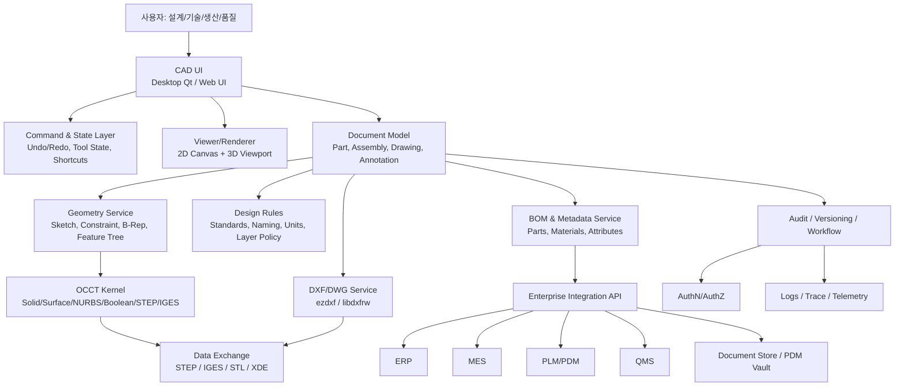

# 중견제조기업용 CAD 시스템 아키텍처 그려줘

아래처럼 **3계층(클라이언트–CAD 엔진–기업시스템)** 구조로 잡으면 중견제조기업용 CAD 아키텍처로 현실적이고 확장성도 좋습니다. OCCT를 기하 커널로 두고, 2D DXF 처리와 3D 모델링, 그리고 ERP/MES/PLM 연동을 분리하는 방식이 검증된 접근입니다.[^1][^2][^3]

## 아키텍처 다이어그램

## 핵심 설계 포인트

- **UI와 엔진을 강하게 분리**해야 합니다. QCAD는 모듈성, 확장성, 이식성을 강조하고 있고, FreeCAD도 핵심 코어는 C++이고 UI·워크벤치·연동은 Python 중심으로 나뉘어 있습니다.[^4][^3]
- **OCCT는 3D 커널과 데이터 교환의 중심**으로 둡니다. OCCT는 2D/3D 모델링, CAD data exchange, visualization을 제공하며 STEP, IGES, STL, VRML 같은 교환 포맷을 다룹니다.[^1][^2]
- **2D는 DXF 우선**으로 설계합니다. QCAD는 DXF/DWG 지원을 갖춘 2D CAD이고, DXF import/export 모듈은 dxflib 기반으로 구성되어 있어 2D 제도 엔진의 레퍼런스로 좋습니다.[^5][^4]
- **기업 연동은 CAD 본체와 분리**합니다. BOM, 품번, 규격, 도면번호, 변경이력은 별도 서비스로 빼야 ERP/MES/PLM 연계가 단순해지고, CAD 엔진 교체에도 영향을 덜 받습니다.

## 모듈 역할

| 모듈 | 역할 | 구현 우선순위 |
| :-- | :-- | :-- |
| Document Model | 도면/부품/어셈블리/주석의 내부 표준 데이터 | 매우 높음 |
| 2D Renderer | 선, 호, 원, 텍스트, 치수 표시 | 매우 높음 |
| Sketch \& Constraint | 구속조건 기반 스케치 편집 | 높음 |
| Geometry Service | Extrude, Revolve, Boolean, Shell | 높음 |
| Exchange Service | DXF, STEP, IGES 입출력 | 매우 높음 |
| BOM Service | 부품 속성 추출, BOM 생성 | 높음 |
| Workflow/Audit | 승인, 버전, 변경이력, 추적성 | 높음 |
| Integration API | ERP/MES/PLM 연계 | 높음 |

## 권장 배포 형태

### 1) 데스크톱 우선

- 설계자용은 **Qt 기반 데스크톱 앱**이 가장 현실적입니다.
- 대형 도면, 정밀 스냅, 3D 뷰어는 브라우저보다 데스크톱이 안정적입니다.
- FreeCAD/QCAD 계열 참고 구조와 잘 맞습니다.[^4][^3]

### 2) 서버 보조형

- 도면 저장, 버전관리, BOM 추출, 인증, 변환 작업은 서버에서 처리합니다.
- 클라이언트는 편집과 시각화에 집중하고, 무거운 변환/검증은 API 서버가 담당합니다.
- 이 방식이 AI 바이브 코딩에도 유리합니다. 프론트와 백엔드를 나누면 프롬프트 단위가 작아지기 때문입니다.

## 단계별 구축 순서

1. **문서 모델부터 정의**합니다. Part, Assembly, Drawing, Layer, Dimension, BOM Item, Revision을 먼저 정리합니다.
2. **2D 뷰어와 DXF 입출력**을 만듭니다. 이 단계에서 도면 열기, 저장, 줌, 팬, 레이어, 치수 표시가 가능해야 합니다.[^4][^6]
3. **스케치와 구속조건**을 붙입니다. Endpoint, Midpoint, Coincident, Parallel, Horizontal 같은 제약부터 시작합니다.
4. **OCCT 기반 3D 기능**을 연결합니다. Extrude, Boolean, STEP export/import를 넣습니다.[^1][^2]
5. **BOM/PLM 연동**을 추가합니다. 도면 속성에서 품번·자재·수량을 추출해 ERP로 넘깁니다.
6. **워크플로와 감사로그**를 넣습니다. 승인, 변경이력, 롤백, 배포 통제를 추가합니다.

## 실무형 기술 선택

| 구분 | 1안: 빠른 MVP | 2안: 장기 확장 |
| :-- | :-- | :-- |
| 언어 | Python | C++ + Python |
| UI | PyQt | Qt |
| 2D | ezdxf | ezdxf + C++ 렌더러 |
| 3D | 제한적 | OCCT |
| 적합성 | 초기 PoC | 상용화/확장 |

## 바로 써먹는 기준

- **2D 중심 업무**가 주력이라면 QCAD/LibreCAD식 구조가 출발점입니다.[^4][^5]
- **3D 형상과 제조 데이터 연계**가 핵심이면 FreeCAD/OCCT식 구조가 정답에 가깝습니다.[^1][^3]
- **사내 시스템 연동이 중요**하면 BOM 서비스와 API 게이트웨이를 CAD 본체에서 분리하는 것이 필수입니다.

원하시면 다음 답변에서 바로 이어서\
**1) ERD**, **2) API 목록**, **3) 화면 목록**, **4) MVP 백로그**까지 한 번에 그려드리겠습니다.

[^10][^11][^7][^8][^9]

⁂

[^1]: https://occt3d.com/dev/doc/overview/html/index.html

[^2]: https://occt3d.com/dev/doc/overview/html/occt_user_guides\_\_xde.html

[^3]: https://www.freecad.org/features.php?lang=en

[^4]: https://www.qcad.org/en/78-qcad

[^5]: https://www.qcad.org/doc/qcad/3.0/developer/group\_\_dxf.html

[^6]: https://ezdxf.readthedocs.io/en/stable/introduction.html

[^7]: https://www.qcad.org/en/qcad-documentation/qcad-features

[^8]: https://www.qcad.org/en/documentation/features

[^9]: https://www.qcad.org/doc/qcad/latest/reference/en/qcad_reference_manual_en.html

[^10]: https://www.qcad.org/en/products

[^11]: https://wiki.freecad.org/OpenCASCADE/cs

