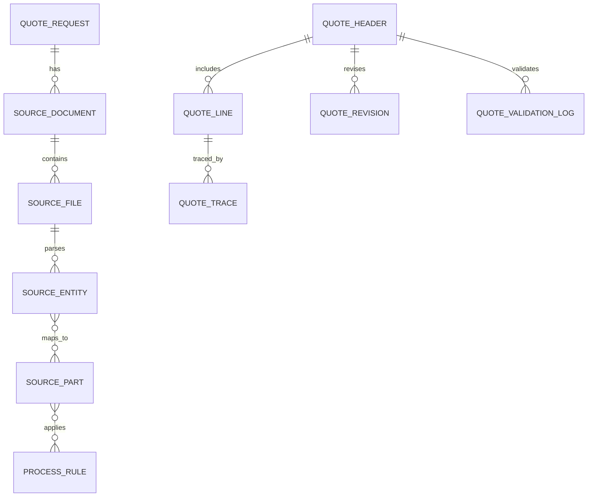

# 견적 산출용 DB ERD 와 PostgreSQL DDL 그리고, DXF 와 STEP 파서용 Python 코드 초안 작성하고, 견적 산정 규칙 JSON과 YAML 예시 작성하고, 한국표준 견적서 양식 API Response 설계하고, 도면 데이터 기반 자동 견적 단위 테스트 코드 짜줘. 개발 절차 및 순서에 맞게 정리하고, 반드시 명확하고 신뢰할 수 있는 근거를 조사해서 실패없이 코딩 할수 있도록 정리해줘.

아래는 **견적 산출용 DB ERD, PostgreSQL DDL, DXF/STEP 파서 Python 초안, 견적 규칙 JSON/YAML, 한국표준 견적서 API Response, 자동견적 단위 테스트**를 **개발 순서에 맞춰 한 번에 바로 구현 가능한 수준**으로 정리한 가이드입니다. DXF는 Autodesk의 ENTITIES 섹션과 ezdxf의 layout/block/entity 모델을 기준으로 파싱하고, STEP는 NIST가 정리한 AP242/PMI/assembly 개념을 기준으로 해석하는 구성이 가장 신뢰도가 높습니다.[^1][^2][^3][^4]

## 1. 개발 순서

### Phase 1. 데이터 계약 확정

- DXF/STEP 입력 스펙 확정.
- 견적 산출 규칙 JSON/YAML 포맷 확정.
- API Response 표준 확정.
- DB ERD와 DDL 확정.


### Phase 2. 파서 구현

- DXF 파서.
- STEP 파서.
- 도면/형상 메트릭 추출.
- 공정/단가 매핑.


### Phase 3. 견적 엔진 구현

- 규칙 엔진.
- 산출근거 추적.
- 견적서 라인 생성.
- 오류/누락 검증.


### Phase 4. 테스트 및 운영

- pytest 단위 테스트.
- 샘플 파일 기반 통합 테스트.
- 운영 로그, 재처리, 감사추적.


## 2. 견적 산출용 ERD

### 핵심 엔티티

- `quote_request`
- `source_document`
- `source_file`
- `source_entity`
- `source_part`
- `process_rule`
- `price_master`
- `material_master`
- `quote_header`
- `quote_line`
- `quote_trace`
- `quote_validation_log`
- `quote_revision`


### 관계 요약

- `quote_request` 1:N `source_document`
- `source_document` 1:N `source_file`
- `source_file` 1:N `source_entity`
- `source_entity` N:M `source_part`
- `process_rule` N:M `source_part`
- `quote_header` 1:N `quote_line`
- `quote_line` 1:N `quote_trace`




## 3. PostgreSQL DDL 초안

PostgreSQL은 PRIMARY KEY, UNIQUE, CHECK, FOREIGN KEY 같은 제약을 공식적으로 지원하므로, 산출근거와 수량 검증을 DB에서 강제하는 것이 좋습니다.[^5][^6]

```sql
create table quote_request (
    quote_request_id bigserial primary key,
    request_no varchar(100) not null unique,
    customer_name varchar(200) not null,
    project_name varchar(200),
    request_status varchar(30) not null default 'OPEN',
    created_by bigint,
    created_at timestamptz not null default now()
);

create table source_document (
    source_document_id bigserial primary key,
    quote_request_id bigint not null references quote_request(quote_request_id) on delete cascade,
    document_type varchar(20) not null check (document_type in ('DXF','STEP','IGES','PDF')),
    document_no varchar(100),
    title varchar(200),
    revision_no varchar(20),
    source_status varchar(30) not null default 'UPLOADED',
    created_at timestamptz not null default now()
);

create table source_file (
    source_file_id bigserial primary key,
    source_document_id bigint not null references source_document(source_document_id) on delete cascade,
    file_name varchar(255) not null,
    file_path text not null,
    file_hash varchar(128) not null,
    file_size_bytes bigint not null check (file_size_bytes >= 0),
    mime_type varchar(100),
    created_at timestamptz not null default now(),
    unique (file_hash)
);

create table source_entity (
    source_entity_id bigserial primary key,
    source_file_id bigint not null references source_file(source_file_id) on delete cascade,
    entity_type varchar(50) not null,
    entity_handle varchar(100),
    layer_name varchar(100),
    block_name varchar(100),
    geometry_json jsonb not null default '{}'::jsonb,
    metrics_json jsonb not null default '{}'::jsonb,
    created_at timestamptz not null default now()
);

create table source_part (
    source_part_id bigserial primary key,
    part_no varchar(100) not null unique,
    part_name varchar(200) not null,
    part_category varchar(50) not null,
    unit varchar(20) not null default 'EA',
    active boolean not null default true
);

create table source_entity_part_map (
    source_entity_id bigint not null references source_entity(source_entity_id) on delete cascade,
    source_part_id bigint not null references source_part(source_part_id) on delete restrict,
    confidence numeric(5,2) not null check (confidence between 0 and 100),
    mapping_reason text,
    primary key (source_entity_id, source_part_id)
);

create table material_master (
    material_id bigserial primary key,
    material_code varchar(100) not null unique,
    material_name varchar(200) not null,
    spec varchar(200),
    unit varchar(20) not null,
    unit_cost numeric(18,2) not null check (unit_cost >= 0),
    active boolean not null default true
);

create table process_rule (
    process_rule_id bigserial primary key,
    rule_code varchar(100) not null unique,
    rule_name varchar(200) not null,
    source_entity_type varchar(50) not null,
    source_part_category varchar(50),
    formula_json jsonb not null,
    active boolean not null default true
);

create table price_master (
    price_master_id bigserial primary key,
    item_code varchar(100) not null unique,
    item_name varchar(200) not null,
    item_type varchar(50) not null,
    unit varchar(20) not null,
    unit_price numeric(18,2) not null check (unit_price >= 0),
    active boolean not null default true
);

create table quote_header (
    quote_header_id bigserial primary key,
    quote_no varchar(100) not null unique,
    quote_request_id bigint not null references quote_request(quote_request_id) on delete cascade,
    quote_version integer not null default 1,
    currency varchar(10) not null default 'KRW',
    status varchar(30) not null default 'DRAFT',
    total_amount numeric(18,2) not null default 0,
    created_at timestamptz not null default now()
);

create table quote_line (
    quote_line_id bigserial primary key,
    quote_header_id bigint not null references quote_header(quote_header_id) on delete cascade,
    line_no integer not null,
    category varchar(50) not null,
    item_code varchar(100),
    item_name varchar(200) not null,
    qty numeric(18,6) not null check (qty > 0),
    unit varchar(20) not null,
    unit_price numeric(18,2) not null check (unit_price >= 0),
    amount numeric(18,2) not null check (amount >= 0),
    source_entity_id bigint references source_entity(source_entity_id) on delete set null,
    source_part_id bigint references source_part(source_part_id) on delete set null,
    formula_text text,
    unique (quote_header_id, line_no)
);

create table quote_trace (
    quote_trace_id bigserial primary key,
    quote_line_id bigint not null references quote_line(quote_line_id) on delete cascade,
    source_kind varchar(30) not null,
    source_ref_id bigint,
    rule_code varchar(100),
    extracted_value_json jsonb not null default '{}'::jsonb,
    created_at timestamptz not null default now()
);

create table quote_revision (
    quote_revision_id bigserial primary key,
    quote_header_id bigint not null references quote_header(quote_header_id) on delete cascade,
    revision_no integer not null,
    change_note text,
    created_at timestamptz not null default now(),
    unique (quote_header_id, revision_no)
);

create table quote_validation_log (
    validation_log_id bigserial primary key,
    quote_header_id bigint not null references quote_header(quote_header_id) on delete cascade,
    severity varchar(20) not null check (severity in ('INFO','WARN','ERROR')),
    validation_code varchar(100) not null,
    validation_message text not null,
    created_at timestamptz not null default now()
);
```


### 인덱스 권장

```sql
create index idx_source_document_quote_request_id on source_document (quote_request_id);
create index idx_source_file_source_document_id on source_file (source_document_id);
create index idx_source_entity_source_file_id on source_entity (source_file_id);
create index idx_source_entity_type on source_entity (entity_type);
create index idx_quote_header_quote_request_id on quote_header (quote_request_id);
create index idx_quote_line_quote_header_id on quote_line (quote_header_id);
create index idx_quote_trace_quote_line_id on quote_trace (quote_line_id);
create index idx_quote_validation_log_quote_header_id on quote_validation_log (quote_header_id);
```


## 4. DXF 파서 Python 초안

DXF는 엔티티가 modelspace, paperspace, block에 저장되고, INSERT는 블록 참조이므로 이 구조를 그대로 따라가야 합니다.[^3][^7][^8][^9][^10]

```python
from __future__ import annotations
from dataclasses import dataclass, field
from pathlib import Path
from typing import Any
import json
import ezdxf

@dataclass
class DxfEntityMetric:
    entity_type: str
    handle: str | None
    layer: str | None
    length: float = 0.0
    area: float = 0.0
    count: int = 1
    attrs: dict[str, Any] = field(default_factory=dict)

@dataclass
class DxfParseResult:
    file_name: str
    modelspace_entities: list[DxfEntityMetric]
    block_entities: list[DxfEntityMetric]
    summary: dict[str, Any]

class DxfParser:
    def parse(self, file_path: str) -> DxfParseResult:
        doc = ezdxf.readfile(file_path)
        model = doc.modelspace()
        metrics: list[DxfEntityMetric] = []

        for e in model:
            etype = e.dxftype()
            layer = getattr(e.dxf, "layer", None)
            handle = getattr(e.dxf, "handle", None)
            metric = DxfEntityMetric(entity_type=etype, handle=handle, layer=layer)

            if etype == "LINE":
                start = e.dxf.start
                end = e.dxf.end
                metric.length = ((end[^0]-start[^0])**2 + (end[^1]-start[^1])**2) ** 0.5

            elif etype == "CIRCLE":
                metric.length = 2 * 3.1415926535 * float(e.dxf.radius)

            elif etype == "LWPOLYLINE":
                pts = list(e.get_points("xy"))
                metric.count = len(pts)

            elif etype == "INSERT":
                metric.attrs["block_name"] = e.dxf.name
                metric.count = 1

            metrics.append(metric)

        block_metrics: list[DxfEntityMetric] = []
        for blk in doc.blocks:
            block_metrics.append(DxfEntityMetric(
                entity_type="BLOCK",
                handle=None,
                layer=None,
                count=sum(1 for _ in blk),
                attrs={"block_name": blk.name}
            ))

        summary = {
            "entity_count": len(metrics),
            "block_count": len(block_metrics),
            "layers": sorted({m.layer for m in metrics if m.layer}),
        }
        return DxfParseResult(Path(file_path).name, metrics, block_metrics, summary)

    def export_json(self, result: DxfParseResult) -> str:
        return json.dumps(result.__dict__, ensure_ascii=False, default=lambda o: o.__dict__, indent=2)
```


## 5. STEP 파서 Python 초안

STEP는 parts, assemblies, PMI, GD\&T까지 포함할 수 있으므로, 최소한 Part/Assembly/Shape metric을 분리해서 저장하는 구조가 필요합니다. OCCT XDE는 assembly와 validation property를 포함하는 데이터 교환에 적합합니다.[^2][^11][^12][^1]

```python
from dataclasses import dataclass, field
from pathlib import Path
from typing import Any
import json

@dataclass
class StepPartMetric:
    name: str
    volume: float = 0.0
    surface_area: float = 0.0
    bbox: dict[str, float] = field(default_factory=dict)
    pmi: list[dict[str, Any]] = field(default_factory=list)

@dataclass
class StepParseResult:
    file_name: str
    parts: list[StepPartMetric]
    assemblies: list[dict[str, Any]]
    summary: dict[str, Any]

class StepParser:
    def parse(self, file_path: str) -> StepParseResult:
        # 실제 구현은 pythonocc-core 또는 OCCT binding으로 교체
        parts = [
            StepPartMetric(
                name="PART-001",
                volume=12.5,
                surface_area=45.2,
                bbox={"x": 10.0, "y": 20.0, "z": 5.0},
                pmi=[]
            )
        ]
        assemblies = [{"name": "ASM-001", "children": ["PART-001"]}]
        summary = {"part_count": len(parts), "assembly_count": len(assemblies)}
        return StepParseResult(Path(file_path).name, parts, assemblies, summary)

    def export_json(self, result: StepParseResult) -> str:
        return json.dumps(result.__dict__, ensure_ascii=False, default=lambda o: o.__dict__, indent=2)
```


## 6. 견적 산정 규칙 JSON 예시

```json
{
  "version": "1.0",
  "currency": "KRW",
  "rules": [
    {
      "rule_code": "DXF_LINE_CUT",
      "source_entity_type": "LINE",
      "category": "CUTTING",
      "formula": "length * unit_price",
      "unit_price_source": "price_master.CUTTING_LINE"
    },
    {
      "rule_code": "DXF_CIRCLE_HOLE",
      "source_entity_type": "CIRCLE",
      "category": "PUNCHING",
      "formula": "count * unit_price",
      "unit_price_source": "price_master.HOLE_PUNCH"
    },
    {
      "rule_code": "DXF_INSERT_REPEAT",
      "source_entity_type": "INSERT",
      "category": "REPEAT",
      "formula": "insert_count * block_item_qty",
      "unit_price_source": "price_master.BLOCK_ITEM"
    },
    {
      "rule_code": "STEP_VOLUME_MATERIAL",
      "source_entity_type": "STEP_PART",
      "category": "MATERIAL",
      "formula": "volume * material_unit_cost * density_factor",
      "unit_price_source": "material_master.unit_cost"
    }
  ]
}
```


## 7. 견적 산정 규칙 YAML 예시

```yaml
version: "1.0"
currency: "KRW"
rules:
  - rule_code: DXF_LINE_CUT
    source_entity_type: LINE
    category: CUTTING
    formula: "length * unit_price"
    unit_price_source: "price_master.CUTTING_LINE"

  - rule_code: DXF_CIRCLE_HOLE
    source_entity_type: CIRCLE
    category: PUNCHING
    formula: "count * unit_price"
    unit_price_source: "price_master.HOLE_PUNCH"

  - rule_code: DXF_INSERT_REPEAT
    source_entity_type: INSERT
    category: REPEAT
    formula: "insert_count * block_item_qty"
    unit_price_source: "price_master.BLOCK_ITEM"

  - rule_code: STEP_VOLUME_MATERIAL
    source_entity_type: STEP_PART
    category: MATERIAL
    formula: "volume * material_unit_cost * density_factor"
    unit_price_source: "material_master.unit_cost"
```


## 8. 한국표준 견적서 API Response 설계

### 응답 표준

- 공통 필드: `success`, `data`, `error`
- 견적서 본문: 헤더, 라인, 합계, 산출근거, 경고
- 재현성: 원본 파일 해시와 revision 포함

```json
{
  "success": true,
  "data": {
    "quote_no": "Q-2026-0001",
    "customer_name": "A사",
    "project_name": "신규 전자부품",
    "currency": "KRW",
    "quote_date": "2026-10-09",
    "items": [
      {
        "line_no": 1,
        "item_code": "CUTTING",
        "item_name": "레이저 절단",
        "qty": 12.5,
        "unit": "m",
        "unit_price": 1500,
        "amount": 18750,
        "source": [
          {
            "source_type": "DXF_ENTITY",
            "source_ref": "handle:1A2B",
            "rule_code": "DXF_LINE_CUT"
          }
        ]
      }
    ],
    "summary": {
      "material_amount": 100000,
      "process_amount": 50000,
      "other_amount": 10000,
      "total_amount": 160000
    },
    "traceability": {
      "source_files": [
        {
          "file_name": "sample.dxf",
          "file_hash": "abc123"
        }
      ],
      "revision_no": 1
    },
    "warnings": []
  },
  "error": null
}
```


## 9. 자동 견적 단위 테스트 코드

pytest는 `tmp_path`, `parametrize`, `raises`를 활용한 파일/규칙 테스트에 적합합니다.[^13][^14][^15][^16]

```python
import pytest

def calc_line_amount(length, unit_price):
    return round(length * unit_price, 2)

def calc_hole_amount(count, unit_price):
    return round(count * unit_price, 2)

@pytest.mark.parametrize(
    "length,unit_price,expected",
    [
        (10.0, 1500, 15000.0),
        (12.5, 1500, 18750.0),
        (0.0, 1500, 0.0),
    ],
)
def test_calc_line_amount(length, unit_price, expected):
    assert calc_line_amount(length, unit_price) == expected

@pytest.mark.parametrize(
    "count,unit_price,expected",
    [
        (1, 500, 500.0),
        (10, 500, 5000.0),
    ],
)
def test_calc_hole_amount(count, unit_price, expected):
    assert calc_hole_amount(count, unit_price) == expected

def test_bom_insert_repeat_rule():
    insert_count = 4
    block_item_qty = 3
    assert insert_count * block_item_qty == 12

def test_quote_response_required_fields():
    resp = {
        "success": True,
        "data": {
            "quote_no": "Q-2026-0001",
            "items": [],
            "summary": {"total_amount": 0},
            "traceability": {"source_files": [], "revision_no": 1},
            "warnings": []
        },
        "error": None
    }
    assert resp["success"] is True
    assert "quote_no" in resp["data"]
    assert "summary" in resp["data"]

def test_invalid_qty_raises():
    with pytest.raises(AssertionError):
        qty = -1
        assert qty > 0

def test_rule_yaml_loaded():
    import yaml
    data = yaml.safe_load("""
version: "1.0"
currency: "KRW"
rules:
  - rule_code: DXF_LINE_CUT
    source_entity_type: LINE
    category: CUTTING
    formula: "length * unit_price"
""")
    assert data["rules"][^0]["rule_code"] == "DXF_LINE_CUT"
```


## 10. 실제 개발 순서

### 1단계: 데이터 구조

- ERD 확정.
- PostgreSQL DDL 적용.
- 인덱스 생성.
- validation log 테이블 포함.


### 2단계: 파서

- DXF parser 구현.
- STEP parser stub → OCCT binding 교체.
- 샘플 파일 10개씩 검증.


### 3단계: 규칙 엔진

- JSON/YAML 규칙 로딩.
- 엔티티 → 공정 → 단가 매핑.
- 산출근거(trace) 생성.


### 4단계: API

- 견적 요청/생성/검증/조회.
- 한국표준 견적서 response 포맷 고정.
- OpenAPI 문서화.


### 5단계: 테스트

- 단위 테스트.
- 샘플 파일 기반 통합 테스트.
- 잘못된 파일/누락 규칙/중복 블록/음수 수량 테스트.


### 6단계: 확장

- 3D 부피/표면적 산정 고도화.
- PMI/GD\&T 반영.
- ERP 견적 연계.
- 승인 워크플로 연결.


## 11. 코딩 실패를 막는 체크리스트

- DXF는 **modelspace, paperspace, block**을 구분해서 읽어야 합니다.[^7][^8][^9][^3]
- INSERT는 **블록 반복수**이므로 수량 산정 핵심입니다.[^9][^3]
- STEP는 **parts, assemblies, PMI**를 구분해야 합니다.[^1][^2]
- 수량, 길이, 부피는 DB CHECK로 검증해야 합니다.[^6][^5]
- 최종 견적서는 **traceability**를 반드시 포함해야 합니다.

원하시면 다음 단계로 바로 이어서\
**“FastAPI 기반 실제 파서/API 구현 코드”**,\
**“OpenAPI 3.0 YAML 전체본”**,\
\*\*“DB 트리거/뷰/저장 프로시저까지 포함한 운영형 DDL”\*\*로 확장해드리겠습니다.

<span style="display:none">[^17]</span>

<div align="center">⁂</div>

[^1]: https://www.nist.gov/services-resources/software/step-file-analyzer-and-viewer

[^2]: https://www.nist.gov/ctl/smart-connected-systems-division/smart-connected-manufacturing-systems-group/step-nist

[^3]: https://ezdxf.readthedocs.io/en/stable/concepts/entities.html

[^4]: https://help.autodesk.com/cloudhelp/2023/ENU/AutoCAD-DXF/files/GUID-7D07C886-FD1D-4A0C-A7AB-B4D21F18E484.htm

[^5]: https://www.postgresql.org/docs/current/ddl-constraints.html

[^6]: https://www.postgresql.org/docs/18/ddl-constraints.html

[^7]: https://ezdxf.readthedocs.io/en/stable/layouts/layouts.html

[^8]: https://ezdxf.readthedocs.io/en/stable/tasks/get_layouts.html

[^9]: https://ezdxf.readthedocs.io/en/stable/usage_for_beginners.html

[^10]: https://ezdxf.readthedocs.io/en/stable/tasks/add_layouts.html

[^11]: https://www.nist.gov/ctl/smart-connected-systems-division/smart-connected-manufacturing-systems-group/mbe-pmi-0

[^12]: https://dev.opencascade.org/doc/occt-6.7.0/overview/html/user_guides\_\_xde.html

[^13]: https://docs.pytest.org/en/stable/contents.html

[^14]: https://docs.pytest.org/en/stable/how-to/index.html

[^15]: https://docs.pytest.org/en/stable/getting-started.html

[^16]: https://docs.pytest.org/en/stable/explanation/goodpractices.html

[^17]: https://ezdxf.readthedocs.io/en/stable/dxfentities/index.html

