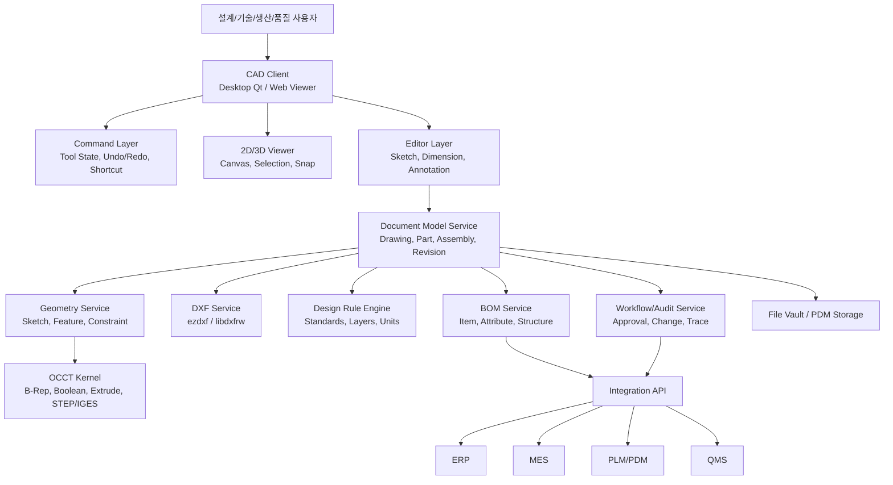
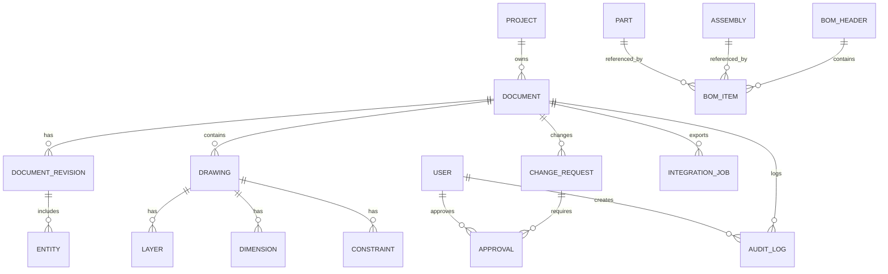

# 바이브 코딩 구현 가이드, 데이터베이스 ERD, 주요 화면 목록, 핵심 API 목록, MVP 백로그와 일정 을 포함하는 종합 가이드 만든다

아래는 **중견제조기업용 CAD 시스템 종합 가이드 초안**입니다. 바이브 코딩 구현 가이드, ERD, 주요 화면, 핵심 API, MVP 백로그와 일정까지 한 번에 이어지도록 **실행형 구조**로 정리했습니다. OCCT의 XDE가 색상·레이어·어셈블리·검증 속성을 다루고 STEP/IGES 연동을 지원하므로, 기업형 CAD의 데이터 모델은 이 계층을 중심으로 설계하는 것이 맞습니다.[^1][^2]

## 1. 목표 아키텍처

이 구조는 FreeCAD가 모듈 단위로 기능을 분리하고, 각 모듈이 App과 Gui로 나뉘는 방식과 잘 맞습니다.[^3][^4]
2D 입력은 ezdxf가 DXF 읽기·수정·쓰기와 여러 DXF 버전을 지원하므로 MVP에 적합하고, 3D 및 교환 포맷은 OCCT가 담당하게 두는 것이 안전합니다.[^5][^1]

## 2. 바이브 코딩 구현 가이드

### 개발 원칙

- **한 번에 CAD 전체를 만들지 말고, 기능을 아주 작은 단위로 쪼갭니다.**
- **UI, 문서모델, 기하연산, 파일입출력, 기업연동을 분리**합니다.
- **AI에게는 “기능 + 입력 + 출력 + 실패조건 + 테스트케이스”를 같이 줍니다.**
- **모든 기능은 샘플 도면 3~5개로 검증**합니다.
- **렌더링과 기하 로직을 분리**해서, 화면 문제를 모델 문제와 혼동하지 않도록 합니다.

### 프롬프트 템플릿

1. **뷰어 생성**
    - “Python, PyQt, ezdxf를 사용해 DXF를 열고 2D 캔버스에 선/원/호/텍스트를 렌더링하는 모듈을 작성해줘. 줌, 팬, 레이어 on/off를 포함하고, 렌더러와 파일로더를 분리해줘.”
2. **스냅 엔진**
    - “마우스 반경 내 Endpoint/Midpoint를 탐색해 스냅하는 엔진을 구현해줘. 탐색 성능을 위해 공간 인덱스를 쓰고, 스냅 마커를 시각화해줘.”
3. **3D 변환**
    - “OCCT를 사용해 폐곡선 스케치를 Extrude하여 솔리드로 만드는 모듈을 작성해줘. open wire, self-intersection, invalid sketch는 예외 처리해줘.”
4. **BOM 추출**
    - “도면 객체의 속성, 부품명, 규격, 수량을 읽어 BOM JSON으로 변환하는 API를 작성해줘.”
5. **테스트 생성**
    - “이 기능에 대한 단위 테스트와 샘플 DXF 기반 통합 테스트를 작성해줘.”

### 코딩 순서

- 1차: 데이터 모델 정의
- 2차: DXF 뷰어
- 3차: 선택/스냅/치수
- 4차: 저장/버전/변경이력
- 5차: 3D 확장
- 6차: ERP/MES/PLM 연동

## 3. 데이터베이스 ERD

### 핵심 엔티티

- **User**
- **Role**
- **Project**
- **Document**
- **Drawing**
- **Part**
- **Assembly**
- **DocumentRevision**
- **Layer**
- **Entity**
- **Dimension**
- **Constraint**
- **BOMHeader**
- **BOMItem**
- **Approval**
- **ChangeRequest**
- **AuditLog**
- **IntegrationJob**
- **ExportJob**

### ERD 관계 설명

- Project 1:N Document
- Document 1:N Revision
- Revision 1:N Entity
- Document 1:N Drawing
- Drawing 1:N Layer
- Drawing 1:N Dimension
- Drawing 1:N Constraint
- Part 1:N BOMItem
- Assembly 1:N BOMItem
- ChangeRequest 1:N Approval
- Document 1:N AuditLog
- IntegrationJob N:1 Document 또는 BOM

### 주요 테이블 컬럼 예시

- **Document**: document_id, project_id, doc_type, doc_no, title, status, current_revision_id
- **DocumentRevision**: revision_id, document_id, rev_no, file_format, file_path, checksum, created_by, created_at
- **Entity**: entity_id, revision_id, entity_type, layer_id, geometry_ref, attr_json
- **BOMItem**: bom_item_id, bom_header_id, item_no, part_no, part_name, qty, unit, source_entity_id
- **AuditLog**: log_id, object_type, object_id, action, old_value, new_value, user_id, created_at

## 4. 주요 화면 목록

### 설계 화면

- 로그인/권한 화면
- 프로젝트 목록
- 도면 목록
- 2D 뷰어
- 2D 편집기
- 스냅/치수/레이어 패널
- 3D 뷰어
- 속성 편집 패널
- 변경이력 화면
- 승인 요청 화면

### 관리자 화면

- 기준정보 관리
- 사용자/권한 관리
- 템플릿 관리
- 라이브러리 관리
- 시스템 로그 화면
- 연동 작업 모니터링
- 변환 실패 목록
- 배포/설정 화면

### 제조 연계 화면

- BOM 미리보기
- 품번 매핑 화면
- ERP 전송 결과
- MES 연동 상태
- PLM 변경 통지 화면

## 5. 핵심 API 목록

| API | Method | 용도 |
| :-- | --: | :-- |
| /api/auth/login | POST | 로그인 |
| /api/projects | GET/POST | 프로젝트 조회/생성 |
| /api/documents | GET/POST | 문서 생성/조회 |
| /api/documents/{id}/revisions | GET/POST | 개정 관리 |
| /api/drawings/{id}/entities | GET | 도형 조회 |
| /api/drawings/{id}/render | GET | 렌더링용 데이터 반환 |
| /api/drawings/{id}/snap | POST | 스냅 후보 계산 |
| /api/files/dxf/import | POST | DXF 업로드 및 파싱 |
| /api/files/dxf/export | POST | DXF 내보내기 |
| /api/files/step/export | POST | STEP 내보내기 |
| /api/files/iges/export | POST | IGES 내보내기 |
| /api/bom/preview | POST | BOM 미리보기 |
| /api/bom/export | POST | BOM JSON/CSV 생성 |
| /api/change-requests | POST | 변경요청 생성 |
| /api/approvals | POST | 승인 처리 |
| /api/integration/jobs | GET/POST | ERP/MES/PLM 연동 작업 |
| /api/audit-logs | GET | 감사로그 조회 |

OCCT XDE는 STEP/IGES 읽기·쓰기와 함께 색상, 레이어, assembly structure를 지원하므로 export/import API는 이 특성을 반영해야 합니다.[^2][^1]

## 6. MVP 백로그

### Sprint 0. 준비

- 개발 표준 결정
- 데이터 모델 초안 확정
- DXF 샘플 수집
- 샘플 도면 검증 기준 수립

### Sprint 1. 기본 뷰어

- DXF 업로드
- 도면 목록
- 2D 렌더링
- 줌/팬
- 레이어 표시

### Sprint 2. 편집 기본

- 선/원/호 선택
- 속성 패널
- 텍스트 표시
- 도면 저장
- Undo/Redo

### Sprint 3. 스냅/치수

- Endpoint/Midpoint 스냅
- 거리/각도 치수
- 스냅 마커 표시
- 그리드/좌표축

### Sprint 4. 개정/감사

- Revision 관리
- 변경요청
- 승인 흐름
- 감사로그

### Sprint 5. BOM 연동

- 속성 추출
- BOM 생성
- 품번 매핑
- CSV/JSON export

### Sprint 6. 3D 확장

- 스케치 기반 Extrude
- STEP export
- 오류 검증
- 간단한 솔리드 편집

## 7. 일정 예시

| 기간 | 목표 | 산출물 |
| :-- | :-- | :-- |
| 1~2주 | 요구사항/데이터모델 | 요구사항서, ERD v1 |
| 3~4주 | DXF 뷰어 | 업로드/렌더링/줌팬 |
| 5~6주 | 편집 기본 | 선택/저장/Undo |
| 7~8주 | 스냅/치수 | 스냅 엔진, 치수 |
| 9~10주 | 버전/승인 | Revision, Audit, Approval |
| 11~12주 | BOM/API 연동 | BOM JSON, ERP 연계 API |
| 13~16주 | 3D PoC | Extrude, STEP export |

ezdxf는 DXF 생성·수정·저장을 공식적으로 지원하고, 여러 DXF 버전과 ASCII/Binary DXF를 다루므로 MVP 기간에 활용하기 좋습니다.[^6][^5]
FreeCAD 개발 문서도 모듈형 구조, App/Gui 분리, 테스트/디버깅, 코드 구조를 안내하므로 장기 확장 설계의 참고점으로 적합합니다.[^4][^3]

## 8. 실행 우선순위

- **1순위:** DXF 뷰어 + 데이터모델
- **2순위:** 스냅/치수/저장
- **3순위:** Revision/승인/감사
- **4순위:** BOM/ERP 연동
- **5순위:** OCCT 기반 3D 확장

원하시면 다음 단계로 바로 이어서\
**“이 내용을 기반으로 한 실제 화면설계서(화면명, UI 구성, 필드, 버튼, 검증룰)”** 또는\
\*\*“PostgreSQL 기준 DDL 초안”\*\*까지 만들어드리겠습니다.

[^10][^7][^8][^9]

⁂

[^1]: https://occt3d.com/dev/doc/overview/html/occt_user_guides\_\_xde.html

[^2]: https://dev.opencascade.org/doc/occt-6.7.0/overview/html/user_guides\_\_iges.html

[^3]: https://freecad.github.io/DevelopersHandbook/

[^4]: https://freecad.github.io/DevelopersHandbook/technical/TheApplicationModule.html

[^5]: https://ezdxf.mozman.at/docs/

[^6]: https://ezdxf.readthedocs.io/en/stable/drawing/management.html

[^7]: https://wiki.freecad.org/Developer_hub/tr

[^8]: https://wiki.freecad.org/Main_Page

[^9]: https://github.com/DensityCo/ezdxf

[^10]: https://github.com/freecad

