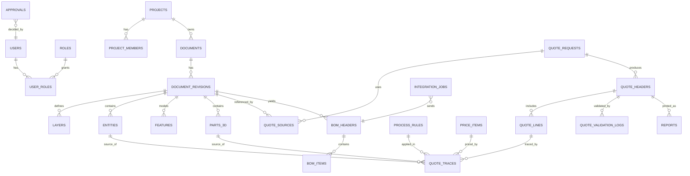

# AX-CAD 정보구조도 (IA) V1.0

> 7단계 개발 절차 중 **3단계 산출물**. 기능명세서(FN)를 메뉴·화면·데이터 구조로 배치한다.
> 근거: `P-Design-System`(네비게이션 구조, 워크벤치), `P-개발참조1·2`(화면 목록, DDL), `P-견적산정-확장2`(견적 ERD), `DESIGN.md`.

## 1. 사이트맵 (전체 메뉴 구조)

```text
AX-CAD
├── 로그인 (/login)
├── 홈 (/)                                   ── 최근 프로젝트·내 할 일(승인 대기, 견적 초안)
├── 프로젝트 (/projects)
│   └── 프로젝트 상세 (/projects/[projectId])
│       ├── 도면 목록 (.../documents)
│       │   └── 도면 상세·개정 이력 (.../documents/[docId])
│       ├── 워크벤치: 2D Draft (.../documents/[docId]/draft)
│       ├── 워크벤치: 3D Model (.../documents/[docId]/model)
│       ├── BOM (.../documents/[docId]/bom)
│       └── 승인 요청 목록 (.../approvals)
├── 견적 (/quotes)
│   ├── 견적 요청 목록 (/quotes)
│   ├── 견적 빌더 (/quotes/[quoteId])           ── 워크벤치: Quote
│   └── 견적서 미리보기·출력 (/quotes/[quoteId]/report)
├── 승인함 (/approvals)                        ── REVIEWER 전용
└── 관리자 (/admin)
    ├── 사용자·권한 (/admin/users)
    ├── 기준정보 (/admin/master-data)
    │   ├── 재질 (…/materials)
    │   ├── 공정·표준공수 (…/processes)
    │   ├── 임률·경비 (…/rates)
    │   ├── 원가 비율 (…/cost-ratios)
    │   └── 레이어·표제란 매핑 (…/mapping-rules)
    ├── 연동 작업 모니터링 (/admin/integrations)
    └── 감사 로그 (/admin/audit)
```

> 💡 FreeCAD처럼 **워크벤치(작업 모드)**를 상단 탭으로 전환한다: `Draft | Model | Quote`. 같은 도면 컨텍스트를 유지한 채 모드만 바뀐다(`DESIGN.md` §1).

## 2. 화면 목록

| ID | 화면명 | 경로(URL) | 접근 권한 | 주요 기능(FN) | 릴리스 |
|---|---|---|---|---|---|
| SCR-01 | 로그인 | `/login` | 전체(비로그인) | FN-25 | R1 |
| SCR-02 | 홈 대시보드 | `/` | 로그인 | 최근 프로젝트, 승인 대기, 견적 초안 | R1 |
| SCR-03 | 프로젝트 목록 | `/projects` | 로그인 | FN-08 | R1 |
| SCR-04 | 프로젝트 상세(도면 목록) | `/projects/[projectId]/documents` | 프로젝트 멤버 | FN-08, FN-01 업로드 | R1 |
| SCR-05 | 도면 상세·개정 이력 | `/projects/[projectId]/documents/[docId]` | 프로젝트 멤버 | FN-09, FN-22 | R1 |
| SCR-06 | 2D Draft 워크벤치 | `…/[docId]/draft?rev=` | 조회: 멤버 / 편집: DESIGNER | FN-02~07 | R1 |
| SCR-07 | 3D Model 워크벤치 | `…/[docId]/model?rev=` | 조회: 멤버 / 편집: DESIGNER | FN-10~13, FN-15 | R2 |
| SCR-08 | 견적 요청 목록 | `/quotes` | ESTIMATOR, REVIEWER, MANUFACTURING | 견적 검색·생성 | R3 |
| SCR-09 | 견적 빌더(Quote 워크벤치) | `/quotes/[quoteId]` | ESTIMATOR(편집), 그 외 조회 | FN-14, 17~20 | R3 |
| SCR-10 | 견적 추적 드로어 | SCR-09 내 오버레이 | 견적 조회 권한 | FN-18 | R3 |
| SCR-11 | 견적서 미리보기·출력 | `/quotes/[quoteId]/report` | ESTIMATOR, REVIEWER | FN-21 | R3 |
| SCR-12 | 승인함 | `/approvals` | REVIEWER | FN-22 | R1·R3 |
| SCR-13 | 승인 상세(도면/견적) | `/approvals/[approvalId]` | REVIEWER | FN-22, 비교 | R1·R3 |
| SCR-14 | BOM | `…/[docId]/bom` | DESIGNER, MANUFACTURING | FN-23, FN-24 | R4 |
| SCR-15 | 사용자·권한 관리 | `/admin/users` | ADMIN | FN-25 | R1 |
| SCR-16 | 기준정보 관리 | `/admin/master-data/*` | ADMIN(편집), ESTIMATOR(조회) | FN-16 | R3 |
| SCR-17 | 연동 작업 모니터링 | `/admin/integrations` | ADMIN, MANUFACTURING | FN-24 | R4 |
| SCR-18 | 감사 로그 | `/admin/audit` | ADMIN, REVIEWER | FN-26 | R1 |

## 3. 화면 간 이동 경로 (Navigation Flow)

```text
[SCR-01 로그인]
   └→ [SCR-02 홈] ─┬→ [SCR-03 프로젝트 목록] → [SCR-04 도면 목록] ─┬→ [SCR-05 도면 상세] → [SCR-13 승인 상세]
                  │                                              ├→ [SCR-06 2D Draft] ⇄ [SCR-07 3D Model]   (워크벤치 탭)
                  │                                              │         ↘ 견적 생성 → [SCR-09 견적 빌더]
                  │                                              └→ [SCR-14 BOM] → (ERP 전송) → [SCR-17]
                  ├→ [SCR-08 견적 목록] → [SCR-09 견적 빌더] ─┬→ [SCR-10 추적 드로어] → (원천 도면 하이라이트 SCR-06/07)
                  │                                         └→ [SCR-11 견적서 출력]
                  ├→ [SCR-12 승인함] → [SCR-13 승인 상세]
                  └→ [관리자 SCR-15~18]
```

- 워크벤치 3종(SCR-06/07/09)은 동일 레이아웃 쉘을 공유하며 상단 탭으로 전환한다.
- SCR-10에서 "도면에서 보기"를 누르면 SCR-06(또는 07)을 열고 해당 `entity_handle`/파트를 선택 상태로 만든다.

## 4. 데이터 구조

### 4.1 ERD (통합: CAD + 견적 + 운영)



### 4.2 엔티티 상세

**A. 사용자·프로젝트**

| 엔티티 | 필드 | 타입 | 필수 | 설명 |
|---|---|---|---|---|
| users | user_id | bigserial PK | Y | |
| | login_id | varchar(100) UNIQUE | Y | |
| | user_name | varchar(100) | Y | |
| | password_hash | text | Y | argon2 |
| | is_active, failed_login_count, locked_until | bool, int, timestamptz | Y/N | 잠금 정책 |
| roles | role_code | varchar(50) UNIQUE | Y | ADMIN, DESIGNER, ESTIMATOR, REVIEWER, MANUFACTURING, VIEWER |
| project_members | project_id, user_id | FK, PK(복합) | Y | 프로젝트 단위 접근 통제 |
| projects | project_id, project_code(UNIQUE), project_name, customer_name, status | | Y | status: ACTIVE/ARCHIVED |

**B. 도면·형상**

| 엔티티 | 필드 | 타입 | 필수 | 설명 |
|---|---|---|---|---|
| documents | document_id PK, project_id FK, doc_no, doc_type, title, status, current_revision_id FK | | Y | UNIQUE(project_id, doc_no); doc_type: DRAWING/PART/ASSEMBLY; status: DRAFT/IN_REVIEW/APPROVED/RELEASED/REJECTED |
| document_revisions | revision_id PK, document_id FK, revision_no, file_format, file_path, checksum, unit, created_by, created_at | | Y | 불변. UNIQUE(document_id, revision_no). file_format: DXF/STEP/IGES/NATIVE |
| layers | layer_id PK, revision_id FK, layer_name, color, linetype, is_locked | | Y | UNIQUE(revision_id, layer_name) |
| entities | entity_id PK, revision_id FK, entity_handle, entity_type, space, layer_id FK, block_name, geometry_json jsonb, attr_json jsonb, metrics_json jsonb | | Y | space: MODEL/PAPER/BLOCK. UNIQUE(revision_id, entity_handle, space) |
| features | feature_id PK, revision_id FK, seq, feature_type, params_json, input_refs jsonb, brep_cache_path, status | | Y | feature_type: EXTRUDE/REVOLVE/FUSE/CUT/COMMON/IMPORT |
| parts_3d | part_id PK, revision_id FK, parent_part_id FK, name, instance_count, volume_mm3, surface_area_mm2, bbox_json | | Y | STEP 조립 트리 |

**C. 기준정보 (버전 관리)**

| 엔티티 | 필드 | 타입 | 필수 | 설명 |
|---|---|---|---|---|
| master_versions | version_id PK, version_code, effective_from, status | | Y | 기준정보 묶음 버전 |
| materials | material_id PK, version_id FK, material_code, density_g_cm3, unit_price_per_kg numeric(18,2), scrap_rate numeric(5,4) | | Y | CHECK ≥ 0 |
| process_rules | process_rule_id PK, version_id FK, rule_code, process_code, input_metric, formula_text, params_json | | Y | 규칙 YAML과 동기화 |
| price_items | price_item_id PK, version_id FK, item_code, item_type(LABOR/MACHINE/OUTSOURCE), unit, unit_price | | Y | 임률·기계경비·외주 단가 |
| cost_ratios | version_id FK, overhead_rate, profit_rate, vat_rate, rounding_rule | | Y | CHECK 0~1 |
| mapping_rules | mapping_rule_id PK, version_id FK, rule_type(LAYER/TITLE_BLOCK), pattern, target | | Y | FN-14 |

**D. 견적**

| 엔티티 | 필드 | 타입 | 필수 | 설명 |
|---|---|---|---|---|
| quote_requests | quote_request_id PK, request_no UNIQUE, customer_name, project_id FK, lot_qty, status | | Y | |
| quote_sources | quote_request_id FK, revision_id FK, material_code, thickness_mm | | Y | 원천 도면 Revision 고정 참조 |
| quote_headers | quote_header_id PK, quote_no UNIQUE, quote_request_id FK, quote_revision_no, master_version_id FK, rule_set_version, status, material_cost, labor_cost, overhead_cost, admin_cost, profit, supply_amount, vat_amount, total_amount | numeric(18,2) | Y | 요약 금액 |
| quote_lines | quote_line_id PK, quote_header_id FK, line_no, cost_category, item_code, item_name, unit, **calculated_qty, calculated_unit_price, calculated_amount**, **override_qty, override_unit_price, override_amount, override_reason, overridden_by, overridden_at**, source_entity_id FK, source_part_id FK | | Y(calculated) / N(override) | CHECK(calculated_qty > 0), CHECK(source_entity_id IS NOT NULL OR source_part_id IS NOT NULL), UNIQUE(quote_header_id, line_no) |
| quote_traces | quote_trace_id PK, quote_line_id FK, source_kind, source_ref_id, rule_code, price_item_id FK, inputs_json, formula_text | | Y | 추적 체인 |
| quote_validation_logs | quote_header_id FK, severity(INFO/WARN/ERROR), code, message | | Y | |
| reports | report_id PK, quote_header_id FK, format(PDF/XLSX), file_path, is_draft, status, created_at | | Y | |

**E. 워크플로·BOM·운영**

| 엔티티 | 필드 | 타입 | 필수 | 설명 |
|---|---|---|---|---|
| approvals | approval_id PK, target_type(DOCUMENT/QUOTE), target_id, requested_by, approver_id, status(PENDING/APPROVED/REJECTED), comment, decided_at | | Y | CHECK(requested_by <> approver_id) |
| bom_headers | bom_header_id PK, revision_id FK, bom_no UNIQUE, source_type(DXF_BLOCK/STEP_ASSEMBLY) | | Y | |
| bom_items | bom_item_id PK, bom_header_id FK, item_no, part_no, part_name, qty, unit, source_entity_id FK, source_part_id FK, mapping_status | | Y | CHECK(qty > 0) |
| integration_jobs | job_id PK, target_system, job_type, idempotency_key UNIQUE, status, attempt_count, request_payload, response_payload | | Y | |
| audit_logs | audit_log_id PK, object_type, object_id, action, old_value jsonb, new_value jsonb, user_id, created_at | | Y | INSERT 전용 |

### 4.3 Research DDL 대비 변경 사항

| 변경 | 이유 |
|---|---|
| `source_*` 테이블 → 기존 `document_revisions`/`entities` 재사용, `quote_sources`로 연결 | CAD와 견적이 같은 원천 데이터를 공유(중복 저장 제거) |
| `source_file.unique(file_hash)` 삭제 | Research 결함 D2 |
| `quote_line`에 calculated/override 분리 컬럼 | REQ-14, `.claude/rules/quote-engine.md` |
| `fn_audit_log()`는 `TG_ARGV[0]`로 PK 컬럼명 전달 | Research 결함 D1 |
| 기준정보에 `master_versions` 도입 | 견적 재현성(NFR-05) |
| `ESTIMATOR` 역할, `project_members` 추가 | 권한 분리, 프로젝트 단위 접근 |

## 5. 완료 체크리스트

- [x] 전체 메뉴 구조(사이트맵)가 정의되었는가
- [x] 모든 화면이 목록화되었는가 (SCR-01~18)
- [x] 화면 간 이동 경로가 설계되었는가
- [x] 데이터 구조가 정의되었는가 (W2에서 Alembic 마이그레이션으로 구체화)
